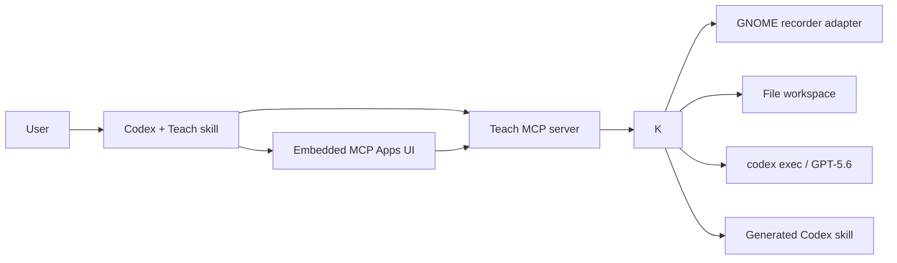
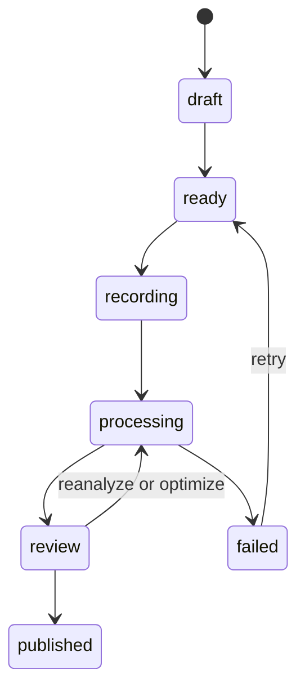

# Architecture

## System context

## Components

### `plugins/teach-gpt`

Installable Codex bundle containing the `$teach` orchestration skill, MCP Apps
component, MCP configuration, self-extracting Linux x86_64 runtime, manifest,
and product assets. It does not hold user recordings. First use expands the
versioned runtime into the user's cache with private permissions.

### `packages/core`

Provider-independent lifecycle, filesystem store, recorder adapters, analyzer,
review patches, replayability checks, and skill compiler. This is the
self-hostable foundation other interfaces can reuse.

### `packages/mcp`

Thin stdio MCP server exposing typed tools for open, begin, start, stop,
analyze, review, optimize, publish, list, and inspect. It registers a
`text/html;profile=mcp-app` resource so supported Codex hosts render the full
teaching lifecycle natively. It delegates all state changes to core.

### `apps/web`

Optional loopback-only Next.js development dashboard over the same core
package. It is not required by the installed plugin or a hosted multi-user service.

## File workspace

`TEACH_GPT_HOME` defaults to `$XDG_DATA_HOME/teach-gpt` or
`~/.local/share/teach-gpt`. Directories use mode `0700`; sensitive artifacts use
`0600`. JSON is written to a same-directory temporary file, synced, and renamed.
The event log stores lifecycle metadata only and never raw screen or text data.

## State machine

Invalid transitions fail closed. Every mutating operation includes a generated
idempotency key in the event log.

## Recording

The GNOME adapter discovers the current user's D-Bus socket from the operating
system rather than relying on graphical environment variables inherited by the
sandboxed plugin process. It calls `org.gnome.Shell.Screencast`, which displays the native
desktop recording indicator. Stop calls `StopScreencast`; `ffmpeg` then samples
bounded frames. The adapter does not register a keyboard event listener. A demo
adapter creates a synthetic clip for tests and judging.

Future adapters implement the same start/stop contract for KDE/Portal, wlroots,
and macOS without changing analysis or storage.

## Analysis and deterministic validation

The default analyzer launches `codex exec` in the session directory with a
read-only sandbox, GPT-5.6, a strict output schema, and an explicit output file.
Only the validated final JSON becomes `analysis.json`. Provider event streams
are not copied into the audit log.

Deterministic code then checks required fields, capability claims, schema
version, step ordering, output-verification presence, and skill paths. Model
output remains a review draft until explicit publication.

## Publishing

The compiler renders human-readable `SKILL.md` plus analysis provenance. Drafts
remain inside the session. Publication copies a validated, collision-safe skill
directory to `TEACH_GPT_SKILLS_HOME` or `~/.agents/skills`, records its version,
and returns the direct `$skill-name` invocation. A new Codex task is recommended
so the initial skill index is refreshed.

## Trust boundary

The embedded component and MCP server run locally. There is no inbound network
listener unless the optional development dashboard is explicitly started. Raw artifacts are never sent
to Devpost, GitHub, or an OpenAI API by the core package. The default analyzer
uses the user's configured Codex host; its sandbox and account policy still
apply.
