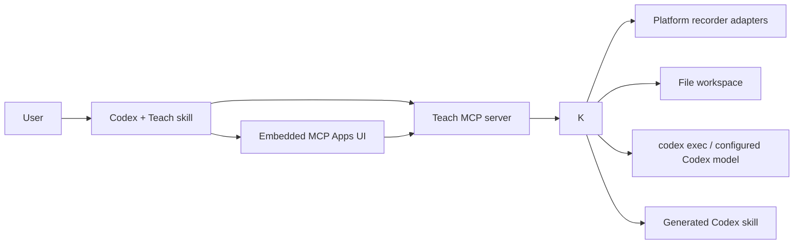
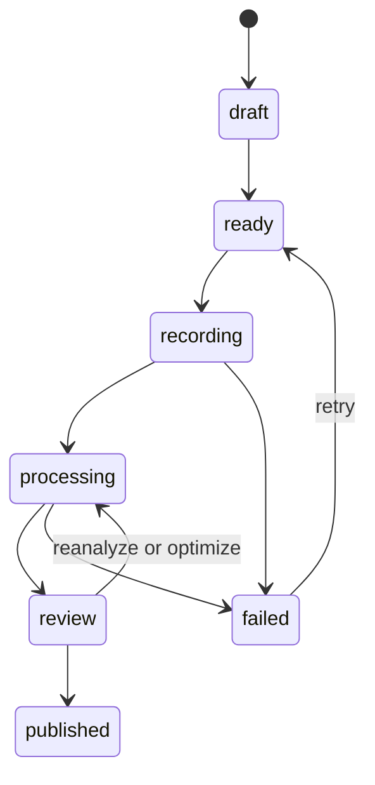

# Architecture

## System context

## Components

### `plugins/teach`

Installable Codex bundle containing the `$teach` orchestration skill, MCP Apps
component, MCP configuration, platform runtimes, manifest, and product assets.
It does not hold user recordings. POSIX hosts select a compressed runtime by
`uname`; Windows resolves the same extensionless MCP command to a small
`teach-mcp.exe` launcher. First use expands the matching versioned runtime into
the user's cache with private permissions. The extracted filename is derived
from the bundled archive content (POSIX checksum or Windows SHA-256), so a
cache-busted plugin can never silently reuse an executable from an older
archive.

### `packages/core`

Provider-independent lifecycle, filesystem store, recorder adapters, analyzer,
review patches, replayability checks, and skill compiler. This is the
self-hostable foundation other interfaces can reuse.

### `packages/mcp`

Thin stdio MCP server exposing typed tools for open, begin, start, stop,
analyze, review, optimize, publish, list, and inspect. It registers a
`text/html;profile=mcp-app` resource so supported Codex hosts render the full
teaching lifecycle natively. It delegates all state changes to core.

### `apps/web`

Optional loopback-only Next.js development dashboard over the same core
package. It is not required by the installed plugin or a hosted multi-user service.

## File workspace

`TEACH_HOME` defaults to `$XDG_DATA_HOME/teach` or `~/.local/share/teach` on
Linux, `~/Library/Application Support/Teach` on macOS, and
`%LOCALAPPDATA%\Teach` on Windows. Directories use private host permissions;
sensitive artifacts use
`0600`. JSON is written to a same-directory temporary file, synced, and renamed.
The event log stores lifecycle metadata only and never raw screen or text data.
Existing `TEACH_GPT_HOME` configuration and `~/.local/share/teach-gpt` data are
used as compatibility fallbacks when no new Teach workspace is configured.

## State machine

Invalid transitions fail closed. Every mutating operation includes a generated
idempotency key in the event log.

## Recording

All adapters implement the same start, arm, stop, abort, and finalized-path
contract. The GNOME adapter discovers the current user's D-Bus socket from the operating
system rather than relying on graphical environment variables inherited by the
sandboxed plugin process. A small GNOME-native helper owns one persistent D-Bus
sender while it calls `org.gnome.Shell.Screencast`, holds capture open, and
handles `StopScreencast`. This is required because GNOME ends capture when the
calling sender vanishes. The adapter persists GNOME's actual output filename,
validates the finalized video with `ffprobe`, and only then asks `ffmpeg` to
sample bounded frames. The adapter does not register a keyboard event listener.
A demo adapter creates a synthetic clip for tests and judging.

On macOS, Teach invokes Apple's `screencapture` video mode and stops it with an
interrupt so the MOV is finalized before validation. macOS owns the Screen &
System Audio Recording permission and privacy indicator. On Windows 11, Teach
uses FFmpeg's `gdigrab` desktop source with pointer drawing and sends FFmpeg its
normal `q` command to finalize an MKV cleanly. The embedded panel provides the
explicit visible recording state on every OS. KDE/Portal and wlroots remain
future adapters.

Frame-directory creation and enumeration use runtime filesystem APIs rather
than Unix `mkdir` or `find`, so post-processing follows the same code path on
Windows. Every adapter requires `ffprobe` validation before frame extraction.

## Analysis and deterministic validation

The default analyzer launches `codex exec` in the session directory with a
read-only sandbox, the user's configured supported Codex model, a strict output
schema, and an explicit output file. `TEACH_MODEL` can override model selection
for environments where that exact model is available.
Only the validated final JSON becomes `analysis.json`. Provider event streams
are not copied into the audit log.

Deterministic code then checks required fields, capability claims, schema
version, step ordering, output-verification presence, and skill paths. Model
output remains a review draft until explicit publication.

## Publishing

The compiler renders human-readable `SKILL.md` plus analysis provenance. Drafts
remain inside the session. Publication copies a validated, collision-safe skill
directory to `TEACH_SKILLS_HOME` or `~/.agents/skills`, records its version,
and returns the direct `$skill-name` invocation. A new Codex task is recommended
so the initial skill index is refreshed.

## Trust boundary

The embedded component and MCP server run locally. There is no inbound network
listener unless the optional development dashboard is explicitly started. Raw artifacts are never sent
to Devpost, GitHub, or an OpenAI API by the core package. The default analyzer
uses the user's configured Codex host; its sandbox and account policy still
apply.
